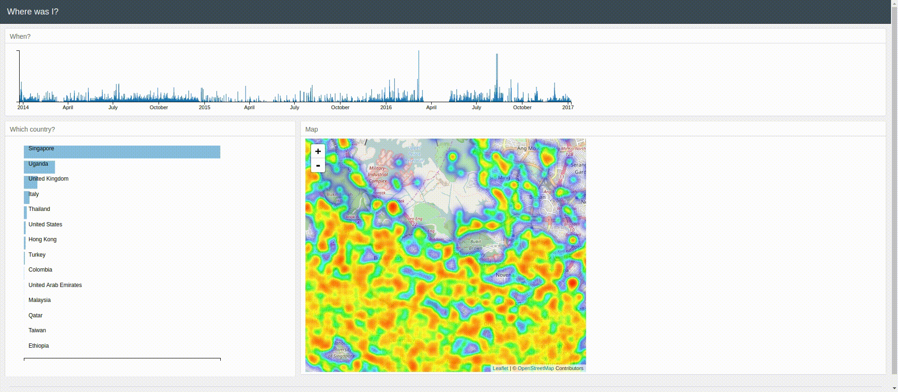

## Map your Google Location History

A simple python web app to visualise your Google location history. Similar to [Google Map's Timeline](https://www.google.com/maps/timeline) but gives a prettier and more comprehensive picture.



## Dependencies

You need ```Python``` libraries: ```Pandas```, ```Flask```, ```Shapely```.

## How to run

1. Install all Python dependencies.
2. Download your Location History data from [Google Takeout](https://takeout.google.com/settings/takeout).
3. Save ```LocationHistory.json``` in the ```input``` folder.
4. From the input folder, run ```python sample_location.py```. This matches points to countries and
samples the data to reduce the file size. This may take a few minutes.
5. From the root folder, run ```python app.py```.

## Inspired by
* [kaggle-talkingdata-visualization](https://github.com/adilmoujahid/kaggle-talkingdata-visualization)
* [How to map your Google location history with R](https://shiring.github.io/maps/2016/12/30/Standortverlauf_post?utm_campaign=Data%2BElixir&utm_medium=email&utm_source=Data_Elixir_113)


